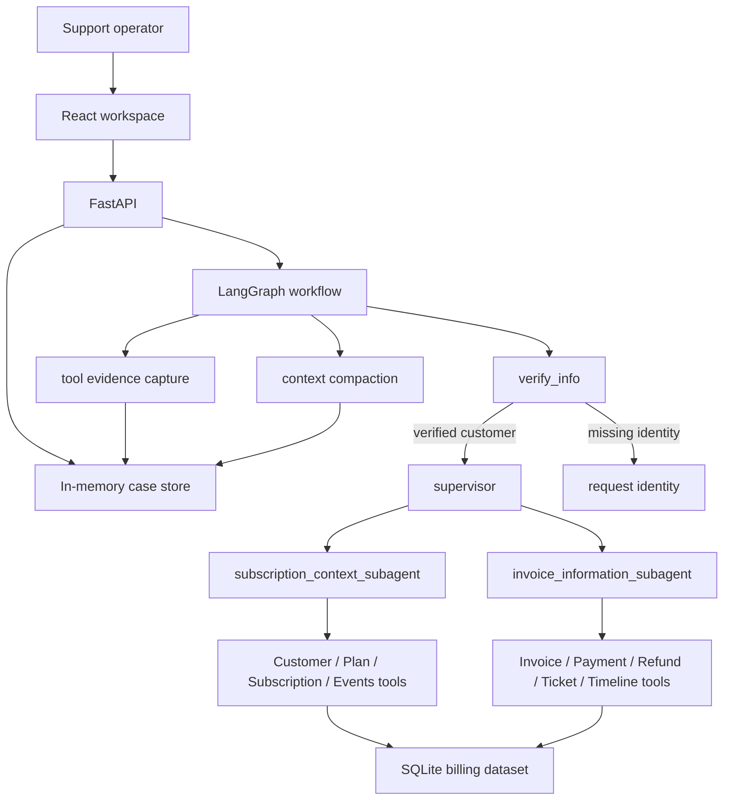

# Billing Ops Copilot

面向订阅制 SaaS 账单支持场景的多 Agent 内部工具。项目使用 LangGraph 编排身份校验、意图路由、订阅上下文查询和账单证据查询，并通过 FastAPI + React 提供前后端分离的客服工作台。

它不是一个通用聊天 Demo，而是一个聚焦 Billing Operations 的支持系统原型：回答需要基于结构化工具查询结果，账单解释需要能追溯到发票、支付、退款、订阅事件和工单证据。

## Highlights

- **多 Agent 路由**：基于 LangGraph 拆分身份校验、Supervisor、订阅上下文 Agent、账单证据 Agent。
- **客户身份校验**：支持通过 Customer ID、邮箱或手机号识别客户，并将 verified customer 写入 case runtime。
- **case 级上下文隔离**：每个会话 case 独立保存消息、已验证客户、case summary 和 evidence refs。
- **上下文压缩**：长对话保留最近消息，并将旧消息压缩为 case summary，减少历史污染和 token 压力。
- **工具证据归因**：所有客户相关查询走结构化工具，覆盖订阅、发票、支付、退款、工单和账单时间线。
- **Agent Harness**：提供不依赖 LLM 的 deterministic harness，用于测试客户切换、工具调用边界和证据一致性。
- **React 工作台**：左侧 case 列表、中间聊天区、加载动画、消息操作和 FastAPI 数据接口。

## Architecture



## Agent Responsibilities

| Component | Responsibility |
| --- | --- |
| `verify_info` | 提取 Customer ID、邮箱或手机号，并解析为 verified customer。 |
| `supervisor` | 判断用户问题类型，将请求路由到合适的子 Agent。 |
| `subscription_context_subagent` | 查询客户资料、套餐、当前订阅、席位、升级、取消和订阅事件。 |
| `invoice_information_subagent` | 查询发票、发票明细、支付、失败支付、退款、工单和账单时间线。 |
| `context.compaction` | 截断长对话，生成 case summary，并捕获工具证据引用。 |
| `harness.runner` | 用脚本化方式验证 Agent 边界，不依赖外部模型服务。 |

## Context Strategy

当前上下文管理采用内存版实现，适合本地演示和快速迭代：

- 每个 case 有独立的 `messages`、`verified_customer_id`、`case_summary` 和 `evidence_refs`。
- LangGraph runtime 通过 `case_id` / `thread_id` 解析当前 case。
- 客户上下文按 `case_id + customer_id` 命名空间保存，避免不同 case 的客户证据互相污染。
- 长对话默认保留最近消息，并把旧消息压缩进 `case_summary`。
- 工具返回的大结果不会原样长期塞进对话历史，而是提取 evidence refs 和摘要。

后续可将 `InMemoryCaseStore` 替换为 SQLite、Postgres 或 Redis，而不改变前端 API 合约。

## Data Model

本地数据由 `subscription_billing.sql` 初始化，并加载为 SQLite 数据集。

| Table | Purpose |
| --- | --- |
| `Customer` | 客户身份、公司、地区、账号状态和负责人。 |
| `Plan` / `PlanFeature` | 套餐、价格和功能限制。 |
| `Subscription` | 当前订阅、席位、续费日期和折扣。 |
| `SubscriptionEvent` | 升级、席位变更、取消、退款请求和支付失败等事件。 |
| `Invoice` / `InvoiceItem` | 发票头信息和发票明细。 |
| `Payment` | 支付尝试、支付状态和失败原因。 |
| `Refund` | 退款记录。 |
| `SupportTicket` | 支持工单和处理状态。 |

## Example Questions

```text
我的 Customer ID 是 5
5 月有没有重复扣费或退款？给我证据
为什么最新发票变贵了？
总结一下这个客户的账单时间线
这个客户当前是什么套餐？
客户 4 为什么是 past_due？
客户 1 为什么 5 月付得更多？
```

## Local Development

### Backend

```powershell
python -m venv .venv
.\.venv\Scripts\python.exe -m pip install -r requirements.txt
.\.venv\Scripts\python.exe -m uvicorn api:app --host 127.0.0.1 --port 8000
```

API health check:

```text
http://127.0.0.1:8000/api/health
```

### Frontend

```powershell
cd frontend
npm install
npm run dev
```

Default frontend URL:

```text
http://127.0.0.1:5173
```

## Docker

Docker is optional and currently starts the backend API only. The React frontend still runs through Vite during local development.

```powershell
Copy-Item .env.example .env
docker compose up --build
```

Backend URL:

```text
http://127.0.0.1:8000/api/health
```

## Environment

Create a `.env` file in the project root:

```text
OPENAI_API_KEY=your-provider-key
OPENAI_API_BASE=https://api.deepseek.com
MODEL_NAME=deepseek-v4-pro
TEMPERATURE=0
API_PORT=8000
FRONTEND_ORIGIN=http://127.0.0.1:5173
```

## Testing

Run the backend test suite:

```powershell
.\.venv\Scripts\python.exe -m pytest
```

Run the frontend production build:

```powershell
cd frontend
npm run build
```

Run deterministic Agent boundary scenarios:

```powershell
.\.venv\Scripts\python.exe scripts\run_harness.py
```

## Project Status

Implemented:

- LangGraph multi-agent billing support flow.
- FastAPI API layer for cases and chat messages.
- React frontend workspace.
- In-memory case runtime and customer context isolation.
- Context compaction and evidence reference capture.
- Deterministic harness for context and tool-boundary checks.

Planned:

- Persistent case storage.
- Evidence panel with invoice, payment, refund and ticket tabs.
- Billing timeline visualization.
- Agent call-chain inspection.
- Exportable case summaries for support handoff.
